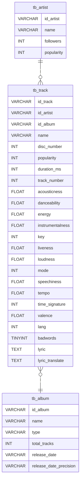

# MusicMiner

O projeto MusicMiner é uma aplicação que utiliza as APIs do Spotify e Vagalume para criar uma base de dados abrangente de músicas. Combinando dados do Spotify, como informações sobre artistas, álbuns e faixas, com letras de músicas fornecidas pelo Vagalume, o MusicDB oferece uma plataforma centralizada para acesso a uma vasta coleção de informações musicais.

## Índice

1. [Tecnologias Utilizadas]
2. [Como Usar]
3. [Banco de Dados]

## Tecnologias Utilizadas

- **API do Spotify:** Utilizada para obter informações sobre artistas, álbuns e faixas.
- **API do Vagalume:** Fornecendo acesso a um vasto banco de dados de letras de músicas.
- **Python:** Linguagem de programação utilizada para desenvolver a lógica do aplicativo.

## Como Usar

**Acesso à API do Spotify:**
   - O acesso à API do Spotify necessita de um *client id* e de um *client secret* fornecidos pelo *Spotify Developer Dashboard* para autenticação . Para mais informações, consulte a documentação oficial em [Spotify Developer Dashboard](https://developer.spotify.com/documentation/web-api).

**Acesso à API do Vagalume:**
   - O acesso à API do Vagalume necessita de um token para autenticação fornecidos pelo Vagalume. Para mais informações, consulte a documentação oficial em [Vagalume API Documentation](https://api.vagalume.com.br/docs/).

**Configurações no Jupyter Notebook:**
   - Abra o arquivo Jupyter Notebook nomeado como "main.ipynb".
   - Informe os tokens de acesso às APIs, e a URL a qual o processo de websraping será realizado, na área denominada #CONFIGURAÇÕES#.

**Execução do Código:**
   - Execute as linhas de código presentes na aba #IMPORTAÇÕES# do Jupyter Notebook. Isso irá validar as informações inseridas na aba #CONFIGURAÇÕES#.

**Exemplos de Utilização:**
   - A aba #PLAYLIST REQUEST# contém um exemplo de utilização para uma URL de playlist.
   - A aba #TRACK REQUEST# contém um exemplo de utilização para uma URL de faixa.

## Banco de dados

**Diagrama de Entidade Relacionamento (DER):**

**Variáveis:**
   - Para compreender melhor as variáveis presentes nos arquivos exportados, consulte a documentação oficial da API do Spotify em [Spotify Developer Dashboard](https://developer.spotify.com/documentation/web-api). Lá você encontrará informações detalhadas sobre cada variável e seu significado.
